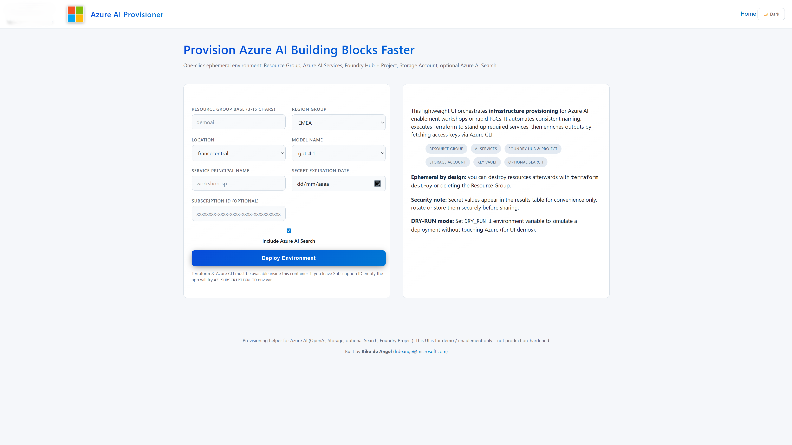
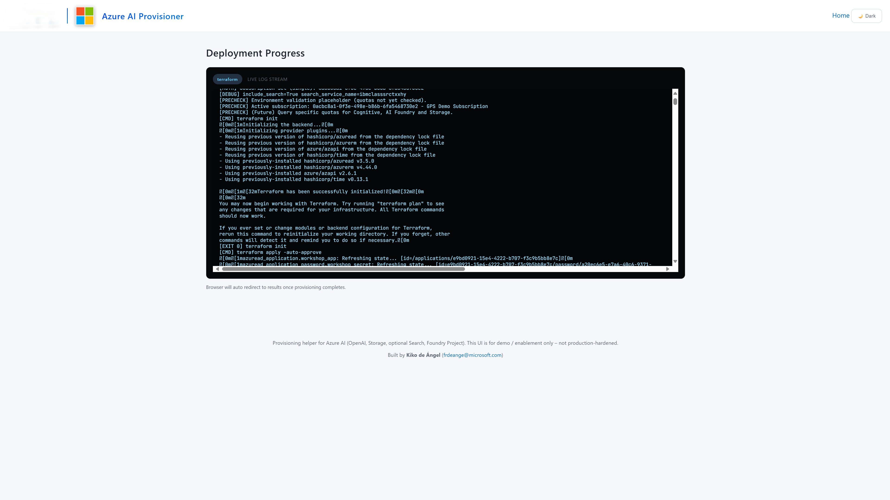
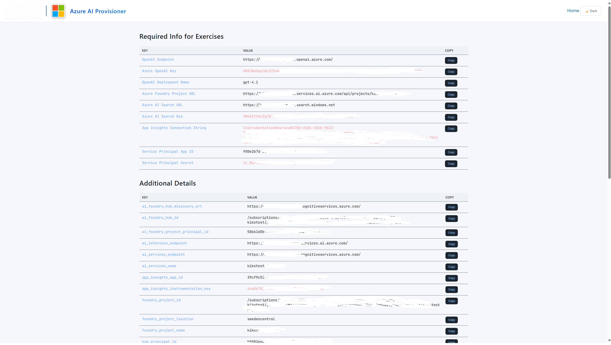
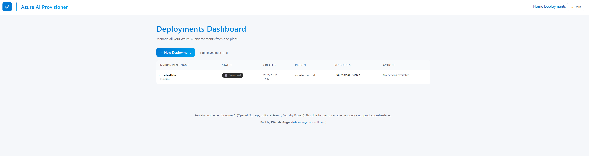

# 🚀 Azure AI Provisioner

<div align="center">

[](https://fastapi.tiangolo.com/)
[](https://www.terraform.io/)
[](https://azure.microsoft.com/)
[](#-quick-start-with-github-codespaces)

**One-click Azure AI infrastructure deployment with real-time streaming logs** ✨

*Transform a simple form into a complete Azure AI environment in minutes*

</div>

---

## 🎯 What Does This Do?

This project provides a **beautiful web interface** that lets you deploy and manage multiple Azure AI infrastructure stacks with just a few clicks. Watch your infrastructure come to life with **real-time streaming logs** as Terraform provisions everything you need for AI/ML workloads.

**New: Multi-Environment Manager** - Create, monitor, and destroy multiple Azure AI environments from a centralized dashboard, with persistent state management and easy credential export.

### 🏗️ What Gets Deployed

| 🎯 Component | 📋 Purpose | 🔧 Implementation |
|--------------|-------------|-------------------|
| **🧠 AI Services Hub** | Foundation for AI workloads | `azapi_resource` with custom subdomain |
| **🏭 AI Foundry Hub** | Central AI workspace | Full RBAC integration |
| **📊 AI Foundry Project** | Project-level isolation | Auto-configured with connections |
| **🤖 OpenAI Models** | GPT-4, GPT-4o deployments | Ready-to-use endpoints |
| **🔍 AI Search** | Vector search capabilities | Optional, enterprise-ready |
| **📈 Monitoring** | App Insights + Log Analytics | Full observability stack |
| **💾 Storage** | Secure blob storage | AAD-only authentication |

---

## 📸 Screenshots

### 1. 📝 **Deployment Form**
*Simple, intuitive form to configure your Azure AI environment*


> Configure resource names, select Azure region, choose AI models, and set Service Principal details

### 2. ⚡ **Real-time Deployment Progress**
*Watch your infrastructure come to life with live Terraform logs*


> Real-time streaming of Terraform execution with WebSocket updates

### 3. 🎯 **Results & Credentials**
*Everything you need for your AI workloads, organized and ready to copy*


> Complete credentials summary with Service Principal details, endpoints, and keys

### 4. 📊 **Multi-Environment Dashboard**
*Manage all your Azure AI environments from one central location*


> View, manage, and destroy multiple deployments with persistent state tracking

---

## ✨ Key Features

### 🎨 **Beautiful UI Experience**
- 🌐 Clean, modern web interface
- ⏱️ Real-time progress tracking with streaming logs
- � **Multi-environment dashboard** - Manage multiple deployments
- �📋 Organized results with "Required for Exercises" section
- 📋 One-click copy for all endpoints and keys
- 🔄 Live WebSocket updates during deployment
- 📄 **Download .env files** - Export ready-to-use environment configurations

### 🎯 **Multi-Environment Management**
- 🗂️ **Persistent state** - Deployments survive container restarts
- 🎛️ **Dashboard overview** - See all environments at a glance
- 🗑️ **Safe destroy** - Clean up resources with confirmation dialogs
- 📈 **Status tracking** - Monitor deployment progress and health
- 🔄 **Live operations** - Real-time logs for create and destroy operations

### 🔒 **Enterprise Security**
- 🚫 **Zero shared keys** - Everything uses Azure AD authentication
- 👥 RBAC-first approach with proper role assignments
- 🔐 Secure key retrieval only when needed
- ✅ Compliance with restrictive tenant policies
- 🛡️ No secrets exposed in logs or outputs

### ⚡ **Smart Infrastructure**
- 🏷️ **Intelligent naming** - Deterministic, Azure-compliant resource names
- ⚡ **Dependency-aware** - Proper resource sequencing and RBAC propagation
- 🔗 **Connection automation** - AI Foundry projects auto-linked to storage and search
- 📡 **Real-time feedback** - Live Terraform logs streamed to your browser

### 🎯 **Ready for AI Workloads**
Get everything you need for AI development:
- ✅ OpenAI API endpoints and keys
- ✅ AI Foundry project URLs (direct API access)
- ✅ Search service endpoints and keys
- ✅ Application Insights connection strings
- ✅ Model deployment names
- ✅ **One-click .env download** - All credentials in ready-to-use format
- ✅ All organized for immediate use in your projects

---

## 🚀 Quick Start with GitHub Codespaces

The fastest way to get started! Everything is pre-configured:

[](https://codespaces.new/your-username/your-repo)

1. **Click the badge above** 👆
2. **Wait for the environment** to initialize (~2 minutes)
3. **Start the app**: `uvicorn app.main:app --reload --host 0.0.0.0 --port 8000`
4. **Open the browser** and navigate to the forwarded port
5. **Deploy your AI infrastructure** with a single form! 🎉

---

## 💻 Local Development Setup

### Prerequisites
- 🐍 Python ≥ 3.10
- 🏗️ Terraform ≥ 1.6.0
- ☁️ Azure CLI ≥ 2.60
- 🔑 Azure subscription with appropriate permissions

### Installation

```bash
# Clone the repository
git clone <your-repo-url>
cd IBM-SessionRequirements

# Create virtual environment
python -m venv .venv
source .venv/bin/activate  # Windows: .venv\Scripts\activate

# Install dependencies
pip install -r requirements.txt

# Login to Azure
az login
az account set --subscription <YOUR_SUBSCRIPTION_ID>

# Start the application
uvicorn app.main:app --reload --host 0.0.0.0 --port 8000
```

🌐 **Browse to**: http://localhost:8000

---

## 🎮 How to Use

### 1. **Fill the Form** 📝
- Enter a **base name** for your resources
- Choose your **OpenAI model** (GPT-4, GPT-4o, etc.)
- Toggle **Azure AI Search** if needed
- Select your **Azure region**

### 2. **Watch the Magic** ✨
- Real-time Terraform logs stream to your browser
- Watch as each resource gets created
- See RBAC roles being assigned
- Monitor the entire deployment process

### 3. **Get Your Results** 🎁
The results page shows two organized sections:

#### 🎯 **Required Info for Exercises**
Everything you need to start coding:
```
✅ OpenAI Endpoint: https://yourname.openai.azure.com/
✅ Azure OpenAI Key: [secure key]
✅ Deployment Name: gpt-4o
✅ AI Foundry Project URL: https://yourname.services.ai.azure.com/api/projects/yourproject
✅ AI Search Endpoint: https://yoursearch.search.windows.net
✅ AI Search Key: [secure key]
✅ App Insights Connection: [connection string]
```

#### � **Download .env File**
Click the **"Download .env file"** button to get all credentials in a ready-to-use environment file format - perfect for importing into your projects!

#### �📊 **Additional Details**
All other resource information for advanced scenarios.

### 4. **Manage Multiple Environments** 🗂️
- Visit `/deployments` to see your **Multi-Environment Dashboard**
- View all deployments, their status, and available actions
- **Destroy environments** safely when no longer needed
- **Download .env files** from any completed deployment
- Track deployment history and resource usage

---

## 🏗️ Architecture Deep Dive

### System Flow
```
🌐 Browser Form
    ↓ (HTTP POST)
⚙️ FastAPI Backend
    ↓ (Generate tfvars)
📋 Terraform Configuration
    ↓ (WebSocket streaming)
☁️ Azure Resources
    ↓ (State persistence)
🗂️ Multi-Environment Dashboard
```

### Multi-Environment Architecture
```
📊 Dashboard (/deployments)
    ├── 🗂️ Deployment List
    ├── 📈 Status Tracking  
    ├── 🗑️ Destroy Actions
    └── 📄 .env Downloads
    
💾 Persistent Storage
    ├── deployments.json (database)
    └── {deployment-id}/
        ├── terraform.tfstate
        ├── terraform.tfvars
        └── metadata.json
```

### Key Design Decisions

#### 🔧 **Technology Choices**
- **FastAPI**: Modern, fast web framework with automatic OpenAPI docs
- **Terraform**: Infrastructure as Code with state management
- **azapi provider**: Bleeding-edge Azure features before azurerm support
- **WebSockets**: Real-time log streaming for better UX

#### 🛡️ **Security First**
- **Storage via azapi**: Bypasses key-based auth restrictions
- **RBAC everywhere**: No shared keys, Azure AD authentication
- **Identity propagation**: Explicit waits for role assignment propagation
- **Workspace-based App Insights**: Avoids legacy billing issues

#### 🏷️ **Smart Naming**
Pattern: `<base><code><random>`
- `base`: Your input (sanitized)
- `code`: Resource type (rg, stg, ais, hub, prj, etc.)
- `random`: 5-6 character suffix for uniqueness

Example: `myproject` → `myprojectrg7k2m`, `myprojectstg7k2m`, etc.

---

## 🔧 Advanced Usage

### Terraform Commands
```bash
cd terraform

# Validate configuration
terraform validate

# Plan changes (dry run)
terraform plan

# Apply changes
terraform apply -auto-approve

# Destroy everything
terraform destroy -auto-approve

# Target specific resources
terraform apply -target=azapi_resource.hub
```

### Extending the Project

#### Add a New Azure Resource
1. **Define variable** in `terraform/variables.tf`
2. **Add naming logic** in `app/main.py`
3. **Create Terraform resource** in `terraform/main.tf`
4. **Add output** in `terraform/outputs.tf` (if needed)
5. **Update UI** in `app/templates/results.html`

#### Add a New Model
1. **Update allowlist** in `app/main.py`:
   ```python
   ALLOWED_MODEL_NAMES = ["gpt-4.1", "gpt-4o", "your-new-model"]
   ```
2. **Update dropdown** in `app/templates/index.html`

---

## 🐛 Troubleshooting

### Common Issues & Solutions

| 🚨 Problem | 🔍 Cause | ✅ Solution |
|------------|----------|-------------|
| **Storage 403 Error** | Tenant blocks key-based auth | ✅ Already handled with `azapi_resource` |
| **Foundry Project 400** | RBAC not propagated | ✅ Increase `time_sleep` duration |
| **Role Assignment Conflict** | Pre-existing roles | ✅ Remove duplicate or import existing |
| **Model Deployment Fails** | Invalid model name | ✅ Check `ALLOWED_MODEL_NAMES` list |
| **Custom Subdomain Error** | Missing subdomain config | ✅ Already handled in azapi hub config |

### Debug Tips
```bash
# Check Terraform state
terraform show

# Validate configuration
terraform validate

# See detailed plan
terraform plan -out=plan.out

# Check Azure CLI context
az account show
```

---

## 🧪 What's New in This Version

### 🆕 Recent Updates
- ✅ **Multi-Environment Manager** - Dashboard to manage multiple deployments
- ✅ **Persistent State** - Deployments survive container restarts 
- ✅ **Destroy Functionality** - Safe resource cleanup with live streaming
- ✅ **Download .env Files** - Export credentials in ready-to-use format
- ✅ **Enhanced Dashboard** - Status tracking and deployment management
- ✅ **Fixed AI Foundry Project URLs** - Now extracts real API endpoints
- ✅ **Enhanced Results UI** - Organized sections for better UX
- ✅ **Improved Security** - Full AAD authentication, no shared keys
- ✅ **Better Error Handling** - Clear error messages and resolution steps
- ✅ **Real-time Streaming** - Live Terraform logs via WebSocket
- ✅ **Smart Dependencies** - Proper RBAC propagation timing

### 🔄 Migration from Previous Versions
If you have an existing deployment:
1. **Backup your state**: `terraform state pull > backup.tfstate`
2. **Update variables**: Remove `key_vault_name` references
3. **Apply changes**: The new version will update existing resources safely

---

## 🤝 Contributing

We love contributions! Here's how to help:

### 🐛 **Bug Reports**
- Use GitHub Issues
- Include error logs and Terraform state (sanitized)
- Describe your environment and steps to reproduce

### 💡 **Feature Requests**
- Check existing issues first
- Describe the use case and expected behavior
- Consider backward compatibility

### 🔧 **Pull Requests**
1. **Fork** the repository
2. **Create** a feature branch
3. **Test** thoroughly:
   ```bash
   terraform validate
   terraform plan -lock=false
   ```
4. **Submit** PR with clear description

### 📋 **Development Guidelines**
- ✅ Keep naming patterns consistent
- ✅ Never expose secrets in outputs
- ✅ Update documentation for new features
- ✅ Test in both Codespaces and local environments

---

## 📚 Additional Resources

### 🔗 **Documentation Links**
- [Azure AI Foundry Documentation](https://docs.microsoft.com/azure/ai-foundry/)
- [Terraform Azure Provider](https://registry.terraform.io/providers/hashicorp/azurerm/latest)
- [FastAPI Documentation](https://fastapi.tiangolo.com/)
- [Azure OpenAI Service](https://docs.microsoft.com/azure/cognitive-services/openai/)

### 🎓 **Learning Resources**
- [Azure AI Learning Paths](https://docs.microsoft.com/learn/browse/?products=azure-cognitive-services)
- [Terraform Tutorial](https://learn.hashicorp.com/terraform)
- [Python FastAPI Tutorial](https://fastapi.tiangolo.com/tutorial/)

---

## 📄 License

This project is available under the [MIT License](LICENSE).

---

## 🙏 Acknowledgments

- **Microsoft Azure Team** for the amazing AI services
- **HashiCorp** for Terraform
- **FastAPI Community** for the excellent web framework
- **Contributors** who help make this project better

---

<div align="center">

**Ready to deploy your AI infrastructure?** 🚀

[](https://codespaces.new/your-username/your-repo)

**Questions? Issues? Ideas?** 💬 

[Open an Issue](https://github.com/your-username/your-repo/issues) • [Start a Discussion](https://github.com/your-username/your-repo/discussions)

</div>
